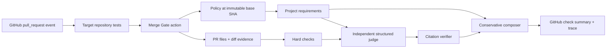
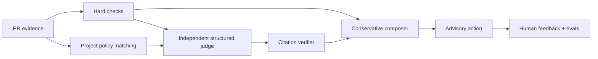

# Merge Gate

Merge Gate is an evaluation-backed control plane for AI-authored pull requests.
It recommends **auto-merge candidate**, **human review**, or **block** from
observable evidence—not from how confident the coding agent sounds.

The demo is advisory. It has no repository write access and never merges code.
Its primary integration is an automatic GitHub PR check. The Streamlit
dashboard opens a public proof PR by default so the same live evidence, project
requirements, decision pipeline, and evaluation can be presented without
pasting a URL.

[Open the public dashboard](https://merge-gate-shzqgrdowxhuply6fhsykf.streamlit.app/)
or follow the [live demo runbook](docs/live-demo.md). The longer
[product and evaluation design](docs/product-and-evaluation-design.md) explains
the problem, users, safety model, rollout, and evaluation strategy. The
[policy guide](docs/policy-guide.md) is the schema reference and connection
guide for writing an organization baseline and a repository overlay policy.

## The problem

Codex and Claude can review a pull request from a prompt. That is useful, but it
does not give a team:

- versioned repository policy;
- deterministic controls that a model cannot override;
- evidence verification for model claims;
- a measured escalation threshold;
- an audit trail of recommendations and human overrides.

Merge Gate is the layer that evaluates and enforces that decision contract.
Its core question is:

> Which escalation policy catches unsafe autonomous changes without sending
> every AI-authored PR to a person?

## Pipeline



The target repository defines its requirements in
`.merge-gate/policy.toml`. Merge Gate reads that file from the PR's base commit,
so a proposed change cannot relax its own rules.

The internal decision path is:



The judge does **not** receive `should_escalate`, `path_risk`, or the label
rationale. PR titles, diff excerpts, and policy text are treated as untrusted
data. A model cannot override failed CI, and invented file or policy citations
cause a safe fallback to human review.

## What is implemented

- Pydantic schemas for PR evidence and model output
- deterministic hard checks and inspectable policy baselines
- versioned policy fixtures with lexical/domain retrieval
- schema-constrained Anthropic judgment with caching, timeouts, and fail-closed errors
- deterministic citation verification
- conservative hybrid decision composition
- read-only live GitHub PR ingestion for metadata, files, patches, check runs,
  and commit statuses
- reusable composite GitHub Action triggered automatically by target PRs
- project-owned TOML requirements fetched from the immutable base commit
- an optional organization-baseline policy layer that a repository overlay
  can tighten but never weaken, with required reviewer teams, time-boxed
  exceptions, and a policy source/version/hash recorded on every decision
- GitHub job summaries containing the outcome, evidence, and tool/function trace
- a sanitized tool/function trace with per-step timing
- explicit unknowns for evidence GitHub cannot prove
- conservative detection of removed assertions and sensitive test-only changes
- original 40-row stress test plus a 14-row held-out challenge set
- critical recall, escalation precision, autonomous coverage, misses, and false
  escalations
- batch evaluation for the actual live judge
- a single-page Streamlit live decision view with evidence, policy, and
  feedback, plus a separate system-evaluation page
- regression tests covering mocked GitHub ingestion, project-policy precedence,
  action summaries, ClearLedger scenarios, and a full Streamlit smoke render

## Live judgment and test fixtures

The product path sends the selected PR's raw evidence and applicable project
requirements to Claude. It does not silently replace a failed provider request
with a simulated judgment: if Claude is unavailable, Merge Gate reports the
failure and produces no AI recommendation.

Deterministic fixtures remain in the evaluation and unit-test paths so the
system can be tested reproducibly without making provider calls. They are not a
selectable product mode. Successful live results are cached by evidence, policy
text, model, and prompt version.

## Automatic GitHub check

The intended experience requires no pasted URL:

1. A developer opens or updates a PR in a connected repository.
2. That repository runs its own tests.
3. Its workflow invokes `adapaania/merge-gate@main`.
4. Merge Gate reads the PR and the repository policy at the base SHA.
5. The GitHub job summary shows the advisory result and execution trace.

The connected example is the public
[ClearLedger demo repository](https://github.com/adapaania/clearledger-demo).
Its [payout-limit proof PR](https://github.com/adapaania/clearledger-demo/pull/1)
runs both ClearLedger tests and Merge Gate automatically. Its local source is
also retained under `clearledger-demo-repo/`. The workflow calls:

```yaml
- uses: adapaania/merge-gate@main
  with:
    github-token: ${{ github.token }}
    policy-path: .merge-gate/policy.toml
    ci-result: ${{ needs.tests.result }}
    anthropic-api-key: ${{ secrets.ANTHROPIC_API_KEY }}
```

The action uses read-only `contents`, `pull-requests`, `checks`, and `statuses`
permissions. A block fails the action job; human review emits a warning; a
candidate emits a notice. The connected repository must define an
`ANTHROPIC_API_KEY` Actions secret.

A repository can also opt into a shared organization baseline by adding
`org-policy-repo` (and optionally `org-policy-ref`/`org-policy-path`) to the
`with:` block above — see the [policy guide](docs/policy-guide.md). Leaving
it unset runs exactly as shown, with the repository's own policy alone.

## Live decision dashboard

The dashboard has one primary page, **Live decision**, and it opens directly
to a public ClearLedger PR — no pasted URL. A **PR #** field lets you switch
between the scenario PRs on that one connected repository; it is not a
generic URL box (that stays on the dev-only replay page). It displays the
observed ClearLedger and Merge Gate checks, links to the real workflow run,
reads `.merge-gate/policy.toml` at the immutable base commit, and, once you
select **Run Merge Gate**, recomputes the detailed advisory decision below.
**Refresh from GitHub** bypasses a three-minute cache so the audience can see
a deliberate live update.

Fetching and judging are deliberately separate:

1. The page load reads GitHub evidence only.
2. **Run Merge Gate** executes policy matching, the live semantic judge,
   citation verification, deterministic controls, and final composition.
3. **Show tools and functions** displays a sanitized trace of those steps.

The app identifies the exact head SHA it evaluated. It does not comment,
approve, close, or merge the PR.

A second page, **System evaluation**, reports aggregate policy metrics over
the labeled fixture sets described below — no GitHub access, so it's safe to
explore without triggering a live model call.

Replaying an arbitrary GitHub PR is a developer-only capability for
troubleshooting, not a normal demo path. It's hidden from navigation unless
`MERGE_GATE_DEV_MODE=1` is set, in which case a **Replay PR (dev)** page
appears.

## Local setup

Python 3.12 is recommended.

```bash
python -m venv .venv
source .venv/bin/activate
pip install -e .
cp .env.example .env
```

To use the live judge, put `ANTHROPIC_API_KEY` in `.env`. To read a private PR,
add a fine-grained `GITHUB_TOKEN` with read-only pull-request, checks, commit
status, metadata, and contents access. Do not commit `.env`.

Run the app:

```bash
streamlit run streamlit_app.py
```

Run the deterministic evaluation:

```bash
python run.py
```

Evaluate the live structured judge over the held-out set:

```bash
python evaluate_judge.py
```

This command makes one provider request for each uncached example. Labels stay
outside the prompt and are used only after predictions are stored.

Run tests:

```bash
python -m unittest discover -v
```

Validate and normalize the committed datasets:

```bash
python data/build_dataset.py
```

## Current held-out result

The hand-authored challenge set contains 14 examples: 8 review-required and 6
safe. It deliberately includes tiny semantic risks, large harmless diffs,
misleading path labels, low-confidence documentation, failed CI, permissions,
incident-linked code, and irreversible deletion.

| Policy | Missed risks | Unnecessary reviews | Critical recall | Autonomous coverage |
|---|---:|---:|---:|---:|
| Always review | 0 | 6 | 100% | 0% |
| Confidence below 80% | 8 | 3 | 0% | 79% |
| Diff over 10 lines | 7 | 5 | 12% | 57% |
| Legacy path-risk rule | 5 | 3 | 38% | 57% |
| Raw-evidence gate | 0 | 1 | 100% | 36% |

These results show that the challenge set breaks the original shortcuts. They
do not establish real-world performance: the dataset is small, synthetic, and
authored by the project creator. Run and report the live-judge batch separately
rather than implying that the deterministic result is an AI-model result.

## Four-minute demo path

1. Open the ClearLedger repository and create the payout-limit scenario PR.
2. Show ClearLedger tests passing automatically.
3. Open the automatically started **Merge Gate** job.
4. Show that `PAY-01` and `SEC-01` require human review even though CI passed.
5. Open the job summary and narrate the GitHub reads, project-policy match,
   judge, verifier, hard controls, and composer.
6. Repeat with the failed-precision PR to show a deterministic block.
7. Use the Streamlit **Live decision** page only afterward to show the same
   decision interactively, and **System evaluation** for aggregate metrics.

## Repository map

```text
streamlit_app.py          demo interface
action.yml                reusable automatic GitHub Action
github_action.py          PR-event runner and GitHub job summary
project_policy.py         target-repository policy parser and evaluator
engine.py                 end-to-end advisory composition
policies.py               deterministic controls and baselines
policy_retrieval.py       inspectable repository-policy retrieval
llm_judge.py              structured live judge and cache
judgment.py               judge schemas and offline fixture
verifier.py               citation verification
evaluation.py             policy and bucket metrics
evaluate_judge.py         batch live-model evaluation
run.py                    deterministic baseline evaluation
model.py                  validated PR-evidence schema
data/                     stress test, challenge set, local feedback
knowledge/                versioned repository-policy fixture
tests/                    regression suite
clearledger-demo-repo/    standalone connected-project source and PR scenarios
.github/                   required CI, CODEOWNERS, and PR template
docs/live-demo.md         public two-repository demo runbook
docs/product-and-evaluation-design.md
                          detailed product and evaluation design
```

## Known limits

- The datasets are synthetic and not independently labeled.
- Policy retrieval is lexical, not a production hybrid retriever.
- GitHub may omit patches for binary or large files; the gate marks that diff
  incomplete and requests review.
- The adapter observes check runs and commit statuses but does not yet read
  branch-protection or ruleset configuration to prove which checks are required.
- The automatic action reads target-repository policy from the base commit, but
  CODEOWNERS and branch-protection rules are not yet evaluated by the engine.
- Reversibility and incident linkage are supplied evidence, not inferred.
- The offline judge is deterministic and must not be presented as a live model.
- The app recommends actions but does not implement GitHub branch protection.
- A production trial needs real historical PRs, blinded multi-reviewer labels,
  calibration by risk tier, access control, observability, and shadow-mode use
  before any merge authority is considered.
